# Set Up

This guide provides step-by-step instructions to set up your development environment and configure **watsonx Orchestrate** for the lab:

1. Install VS Code 
2. Install Python 3.11 
3. Install dependencies
4. Register and provision a watsonx Orchestrate free trial
5. Activate your watsonx Orchestrate environment 
6. Set up third-party models


## 1. Installing VS code (Only for the coding lab)
Here is the link to download VS code
https://code.visualstudio.com/download

## 2. Installing Python 3.11

Before proceeding, ensure you have Python 3.11 installed on your system.

#### On Ubuntu/Linux:
```
sudo apt update
sudo apt install python3.11 python3.11-venv python3.11-distutils
```

#### On Windows:
1. Download the Python 3.11 installer from the [official Python website](https://www.python.org/downloads/release/python-3110/).
2. Run the installer and follow the prompts. Make sure to check "Add Python to PATH" during installation.

#### Verify installation:

##### Mac
```
python3.11 --version
```
You should see output similar to: `Python 3.11.x`

##### Windows

```
py -3.11 --version
```


## 3. Install dependencies
Install and create a virtual environment from `requirement.txt`. Ensure your python version is 3.11

Run the following command

#### Mac
```
python3.11 -m venv venv
source venv/bin/activate
pip install -r requirements.txt
```

#### Windows (Powershell)
```
py -3.11 -m venv venv
venv\Scripts\activate
pip install -r requirements.txt
```


## 4. Registering and provisioning watsonx Orchestrate Free Trial

1.Please access the following link:
https://www.ibm.com/products/watsonx-orchestrate and click on `Try it for free`
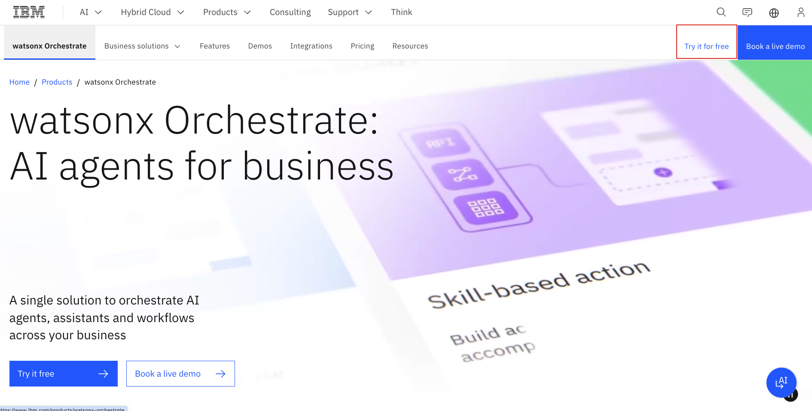

2.please fill in your email address can be personal email address and other information to register for watsonx Orchestrate
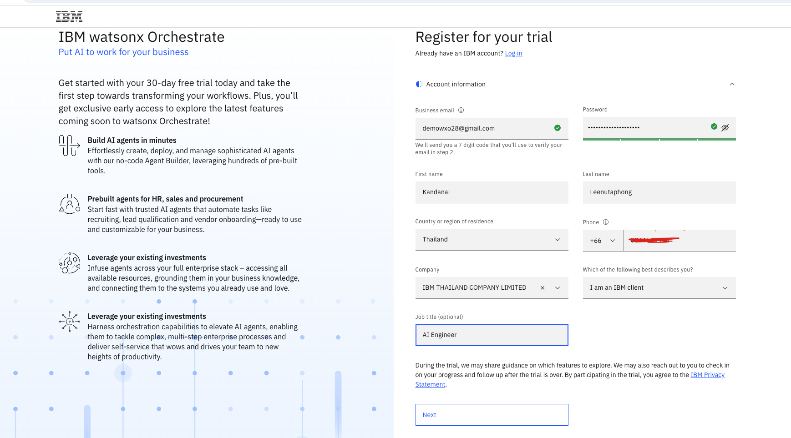


3.After registering you should get a code to your email.
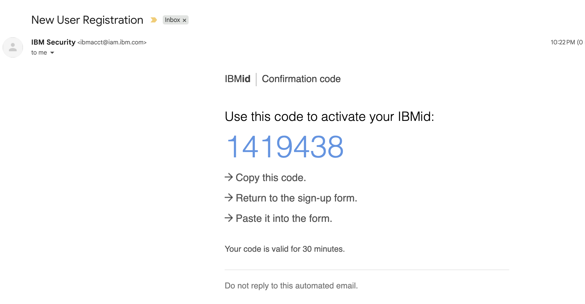

4.Please add the code to register for free trial
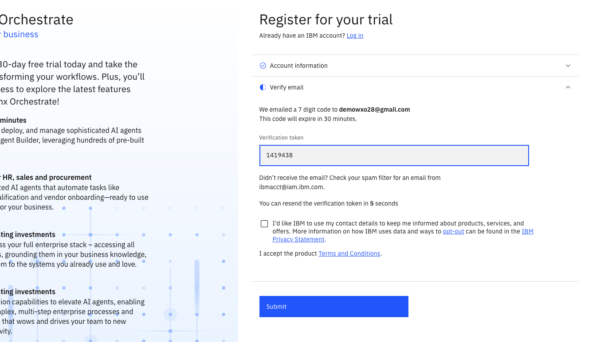

5.Once registered please deploy the trial in `us-east` region
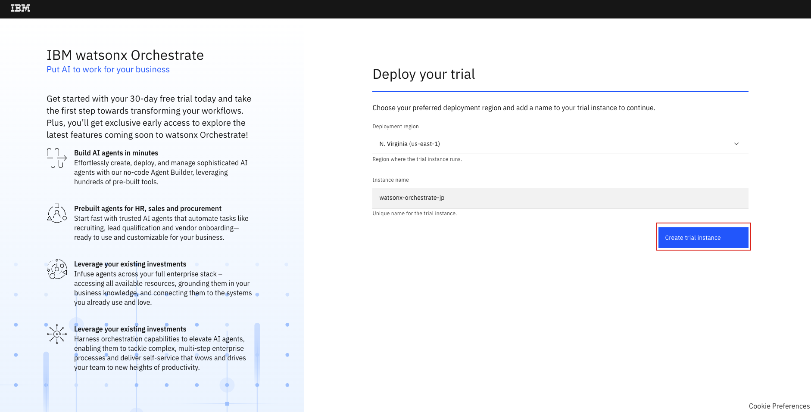

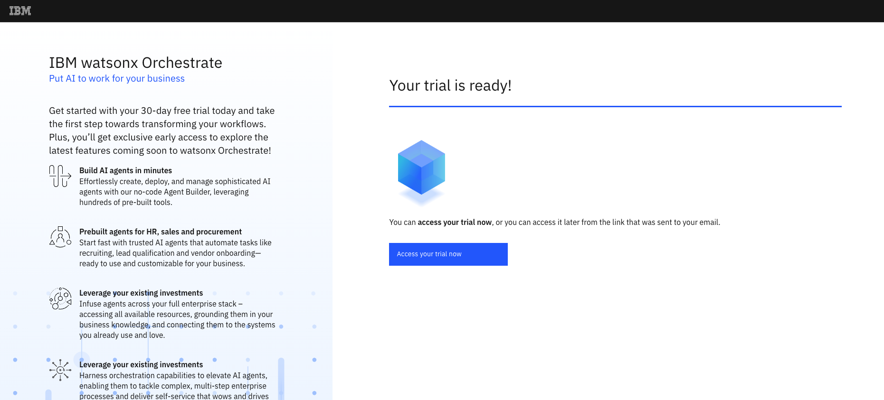

6.You will be directed to: https://dl.watson-orchestrate.ibm.com/. Afterwards please, login with the IBMid and password you signed up with.

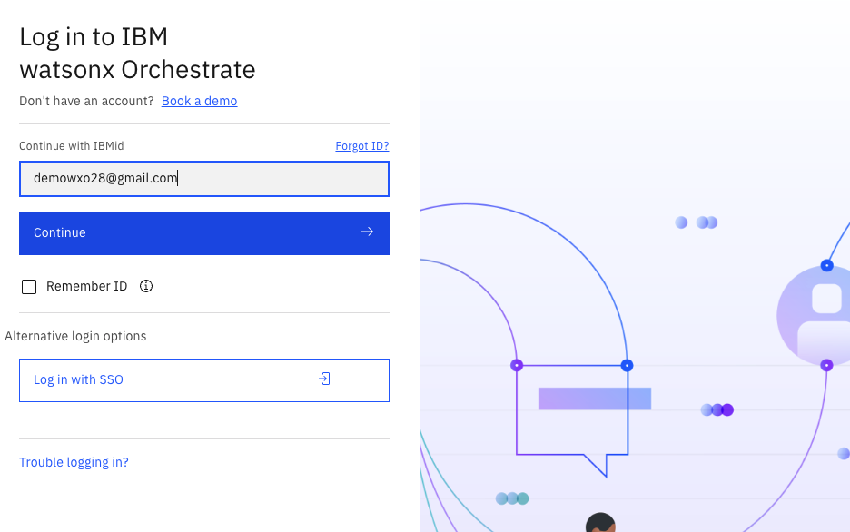

7.Your instance have been successfully provisioned once you landed here.
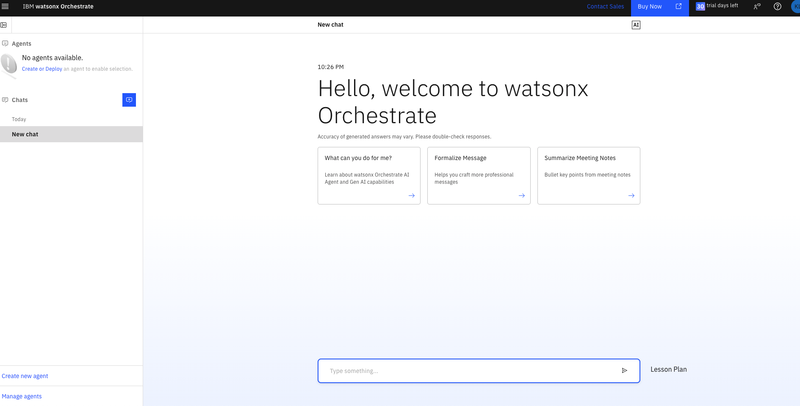


<!-- ### Incase you cant run your script Make sure the scripts executable (run this once):

#### For Linux/macOS:
```bash
chmod +x import_all.sh
```

#### For Windows (PowerShell):
Open PowerShell and run:
```powershell
Set-ExecutionPolicy -ExecutionPolicy RemoteSigned -Scope CurrentUser
Unblock-File -Path .\import_all.ps1
```

Then run the script:
```powershell
./import_all.ps1
``` -->


## 5. Activating watsonx Orchestrate environment
Assuming your are running watsonx Orchestrate on AWS Cloud (Saas),
Please get your credentials from 
```
orchestrate env list
orchestrate env add -n trial-env -u <Service instance URL>
orchestrate env activate trial-env
(Then enter API Key)
```

Alternatively,
```orchestrate env activate trial-env --api-key <your_APIKEY>```


https://developer.watson-orchestrate.ibm.com/environment/production_import


<!-- 
## 6. Setup Third Party Model 

To improve Thai language performance, watsonx Orchestrate supports external models via the `AI gateway`. See more: [Managing LLMs](https://developer.watson-orchestrate.ibm.com/llm/managing_llm). In this lab we will use `google/gemini-2.5-flash` 
-->

<!-- STEPS: -->
<!-- 1. Rename `env-template` to `.env` and add your `GOOGLE_API_KEY` which we will provide to you 

(if you want to use your own API, you can also get it from [Google AI Studio](https://aistudio.google.com)). -->
<!-- 2. If you cannot create an API key, enable Gemini API and create a project in Google Cloud Console.
    - 
    - 
    - 
    - 
    - 

3. Complete the instructions in `00_SETUP`. -->
<!-- 
1. Go to the WatsonxOrchestrate connections tab and add a connection named `gg_creds_UI`.
    - 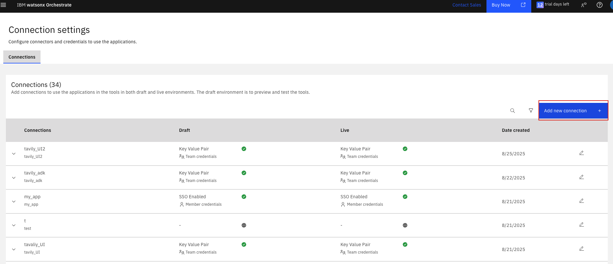
    - 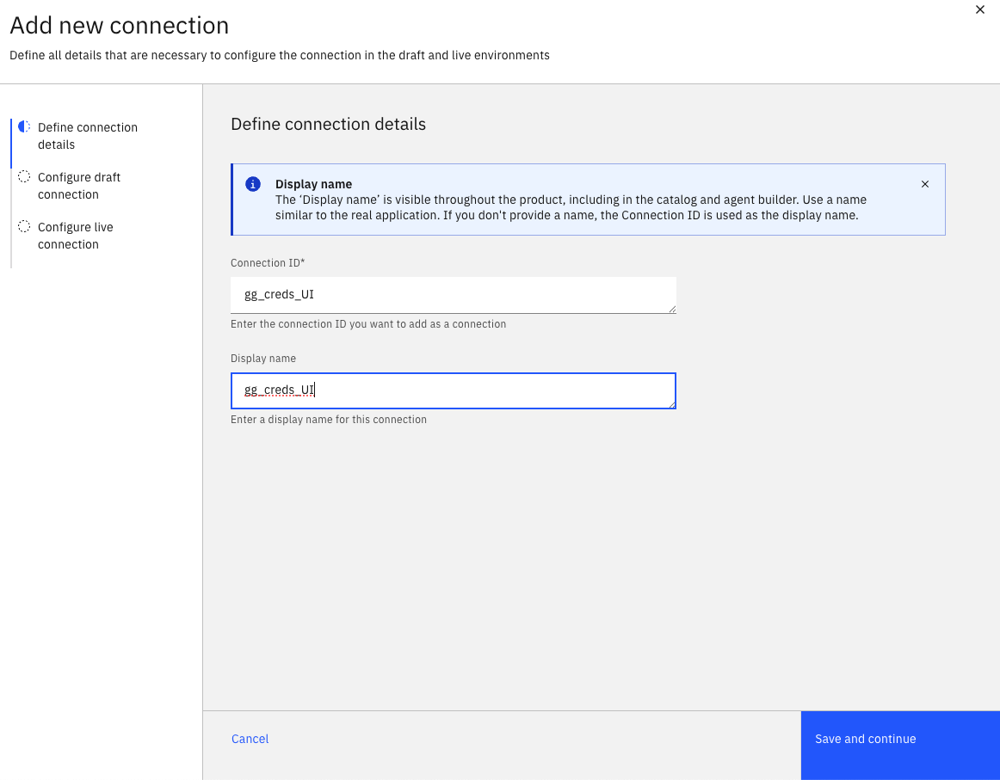
3. For both draft and live environments, add a key-value pair: `api_key` = your GOOGLE_API_KEY key. 
    - 
    - 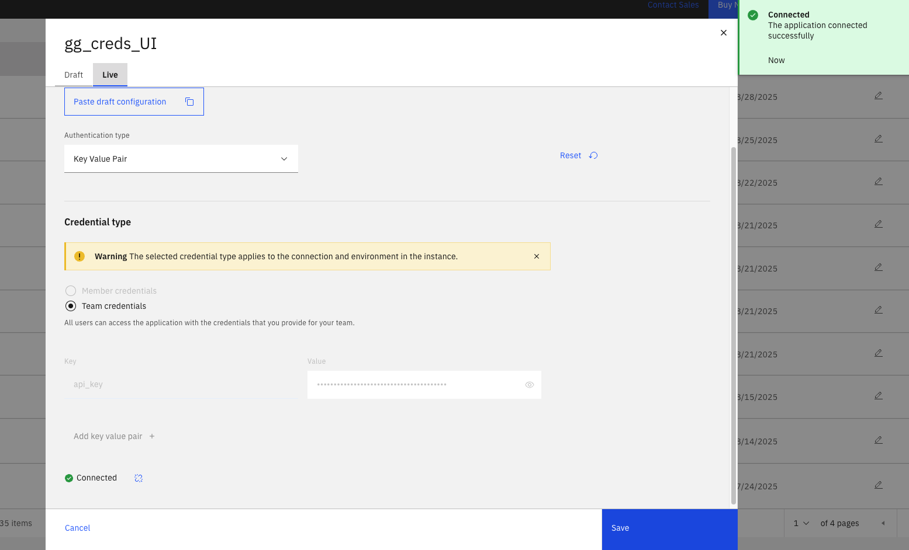

** we will provide the GOOGLE_API_KEY for you
(if you want to use your own API, you can also get it from [Google AI Studio](https://aistudio.google.com))


3. In your terminal, run:
    ```bash
    orchestrate models add --name google/gemini-2.5-flash --app-id gg_creds_UI
    ```
    - 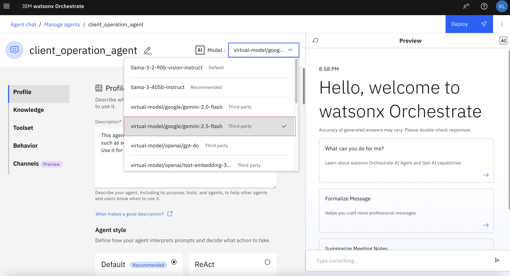
 -->
