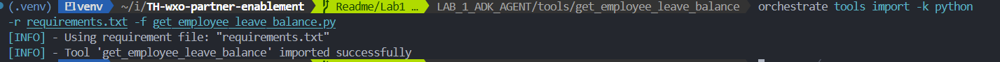
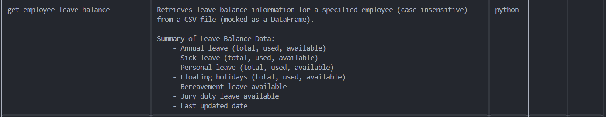
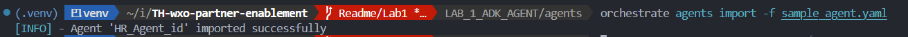
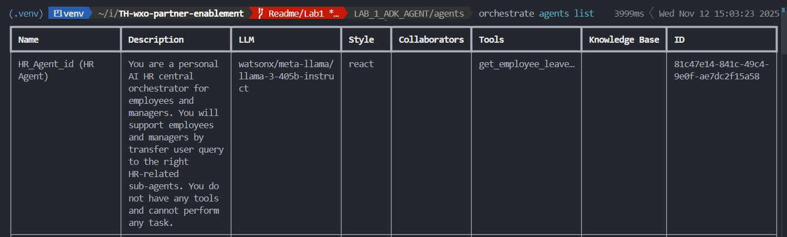
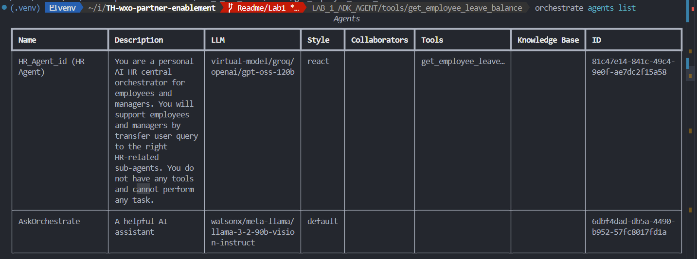
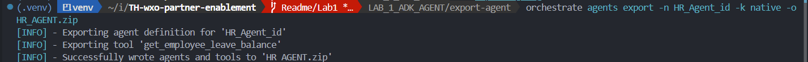
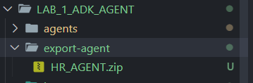

# Lab 1: ADK Agent
This lab demonstrates how to import an agent and its tool into watsonX Orchestrate (wxO) using the ADK.

### Prerequisites
- Complete Lab_0 (setup the lab environment).
- Have the `orchestrate` CLI installed and configured.

## 1 — Activate your environment
List available environments and activate the one you'll use:

```
orchestrate env list
orchestrate env activate trial-env -a <YOUR_API_KEY>
```

## 2 — Import the tool

1.Change directory to the tool folder:

```
cd LAB_1_ADK_AGENT/tools/get_employee_leave_balance
```

2.Install the tool's Python dependencies into your active environment so required libraries are available:

```
pip install -r requirements.txt
```

3.Import the tool into watsonX Orchestrate:

```
orchestrate tools import -k python -r requirements.txt -f get_employee_leave_balance.py -p .
```

4.Verify the tool is listed in wxO:

```
orchestrate tools list
```




---

## 3 — Import the agent

1.Change directory to the agents folder:

```
cd LAB_1_ADK_AGENT/agents
```

2.Make sure the related tool has already been imported (see Step 2), then import the agent:

```
orchestrate agents import -f sample_agent.yaml
```

3.Verify agents in wxO:

```
orchestrate agents list
```




--- 

### Testing queries
- ฉันคือEMP001อยากทราบจำนวนการลาคงเหลือของฉัน
- ฉันคือEMP002อยากทราบจำนวนการลาคงเหลือของฉัน
- ฉันคือEMP003อยากทราบจำนวนการลาคงเหลือของฉัน
- ฉันคือEMP004อยากทราบจำนวนการลาคงเหลือของฉัน
- ฉันคือEMP005อยากทราบจำนวนการลาคงเหลือของฉัน


---

## 4 — Export the agent and tools (Optional)

This task demonstate how to export the agent and tools

1.Change directory to ***LAB_1_ADK_AGENT***
```
cd LAB_1_ADK_AGENT
```

- create a directory named **export-agent** / or using cli to create directory

```
mkdir export-agent
```
- change directory into it
```
cd export-agent
```

use this following command to list all availiable agents in your instance and display the tools each agent uses
```
orchestrate agents list
```


---

Export the agents and tools with following command (This command will get agent as yaml file along with tools used by that agent):

```
orchestrate agents export -n HR_Agent_id -k native -o HR_AGENT.zip
```





unzip the **HR_AGENT.zip** 


