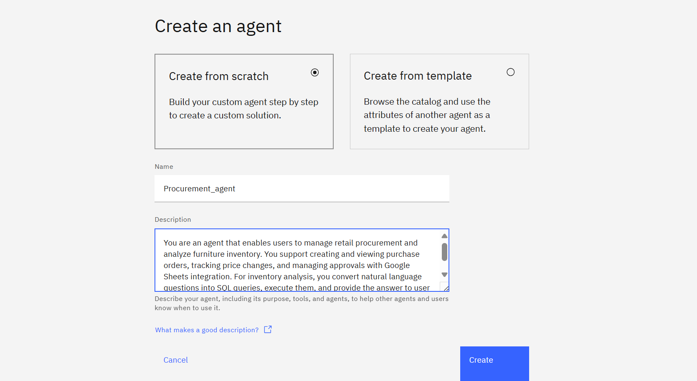
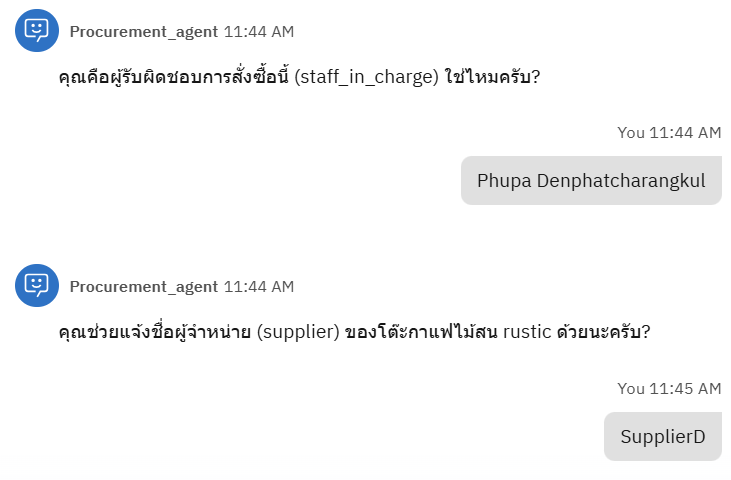

# Procurement Agent Setup

This agent helps users manage retail procurement and analyze inventory. 

Application:
- creating/viewing purchase orders
- tracking price changes
- managing approvals with Google Sheets integration
- converts natural language questions to SQL queries, executes them

### Creating agent

1. Go to Watsonx Orchestrate Agent Builder and create a new agent with the following information

	**Agent name:**

	```Procurement_agent```

	**Agent Description:**

	```markdown
	You are an that agent helps users manage retail procurement and analyze market inventory. It supports creating/viewing purchase orders, tracking price changes, and managing approvals with Google Sheets integration. For market analysis, it converts natural language questions to SQL queries, executes them, and provides answers to help users make decisions 
	```

	

	**Agent Behavior:**

	```markdown
	How To Use Tools
	1. View purchase order - use this to view the history of order placed
	2. create new purchase order - use this to place new order *when placing order always provide detail summary and yes no question to make sure the information is correct. before placing order. after place order, provide the summarize again in mark down tabel format
	3. convert_text_to_sql - use this to convert questions about product data in the current market inventory into SQL queries and execute them against the furniture database. if the data are showable in markdown tabel format, do so.
	4. send_email - Send email via Gmail with support for CC and BCC recipients

	Answer in the same language as user query.
	Make sure you answer satisfy user question before asking to
	continue your task.
	When asking and answering questions please make sure you do
	it in friendly and professional manner.
	```


2. Add tools using the OpenAPI spec file: `procurement_openapi.json`, `openapi_text2sql.json`, `automation_openapi.json`

	
	
	

**Select only these tools from each OpenAPI spec:**

- `procurement_openapi.json`: View purchase order history, Create a new purchase order
- `openapi_text2sql.json`: convert_text_to_sql
- `automation_openapi.json`: send_email


## Example Test Queries (Thai)

`procurement_openapi.json`

1. ดึงข้อมูลออเดอร์ล่าสุดของแต่ละสินค้าในประวัติการสั่งซื้อ

	<!--  -->

2. ขอดูข้อมูลของสินค้า 3 ชนิดนี้ในตลาด
<!-- 
	
	
	
	 -->

3. เปรียบเทียบราคาสินค้าในประวัติการสั่งซื้อกับราคาสินค้าในตลาด เพื่อดูว่าอันไหนราคาต่ำกว่า
	<!--  -->

4. ผมพึ่งสั่งซื้อโต๊ะกาแฟไม้สน rustic ราคา 399.99 บาท ช่วยเพิ่มในประวัติให้หน่อย
<!-- 
	
	
	
	 -->

5. ส่งอีเมลสรุปรายการสินค้าที่สั่งนี้ไปหา {Your email} ด้วยหัวข้อ "New order"
<!-- 
	
	 -->


Access the Google Sheet to see real-time updates:
[Order History Sheet](https://docs.google.com/spreadsheets/d/1bnyC1w1z2VX3ZJjz6iex4oHFPK7D2F3ws3SxgKLc_XI/edit?usp=sharing)


<!-- `openapi_text2sql.json`
- สินค้าในแต่ละหมวดหมู่มีกี่ชิ้น
- สินค้าที่ราคาสูงกว่า 1000 บาทมีอะไรบ้าง
- สินค้าที่ต้องประกอบและไม่ต้องประกอบมีกี่ชิ้น
- สินค้าในหมวดห้องนั่งเล่นทั้งหมด
- วัสดุที่ใช้ทำเฟอร์นิเจอร์มีอะไรบ้างและใช้กี่ชิ้น
- สินค้าที่มีสถานะสต็อกน้อยคืออะไร
- ราคาเฉลี่ยของสินค้าในแต่ละหมวดหมู่
- สินค้าที่มีการรับประกันมากกว่า 3 ปี
- สินค้าที่น้ำหนักมากกว่า 100 ปอนด์
- มูลค่าสต็อกรวมของสินค้าทั้งหมด


`automation_openapi.json` -->

## 4. Flow Overview

1. Get the latest orders from each item in order history (to check prices for possible supplier substitute)
2. Compare to current market prices and suggest changes if lower prices are found
3. Create order in order history Google Sheet
4. Confirm order and update order history
5. View order info from order history in Google Sheet
6. Send as a report (email)

---

