### Instructions

This lab shows how to create an agent and a simple flow that accepts a tax invoice from the user and validates it against specific rules to determine if the invoice is valid. The output will be a validation result indicating whether the tax invoice passes all the required validation rules.

Prerequisites

- Access to the Studio UI where agents and flows are created.

## Steps

1. Create the agent<br/>
   1.1 Choose `create from scratch`<br>
   1.2 Create a new agent named `tax_invoice_validation_agent` <br>
   1.3 Set the description to :<br>
   `This agent validates tax invoices against specific rules including date validation, company address verification, and tax ID validation. The output will be a validation result indicating if the invoice passes all rules.`

---

2. Add a Tool that Using a New Flow <br>
   2.1 In the agent settings, open the Toolset section and click **Add tool**.<br>
   2.2 Choose **Create a new flow**.<br>
   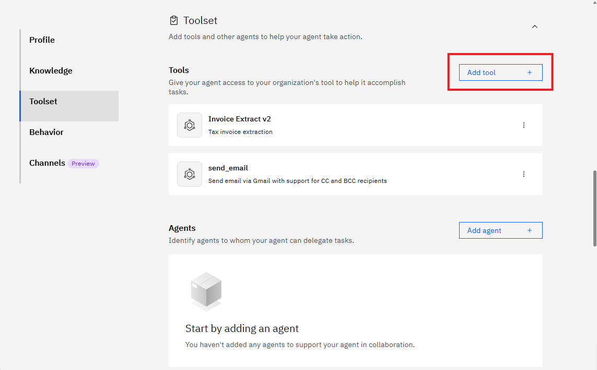
   

   2.3 Click the flow title (usually `Untitled`) in the top-left to open the flow settings.
   

   2.4 Change the tool name to `tax_invoice_validation_tool` and set the description to `This tool validates tax invoices against predefined rules for date, address, and tax ID validation`.<br>
   2.5 Click Save.

   

---

#### Create the workflow

1. Add a User Activity node

- Hover over the connection line between Start and End until a plus (+) appears.
- Click the plus icon and select `User activity` from the menu.

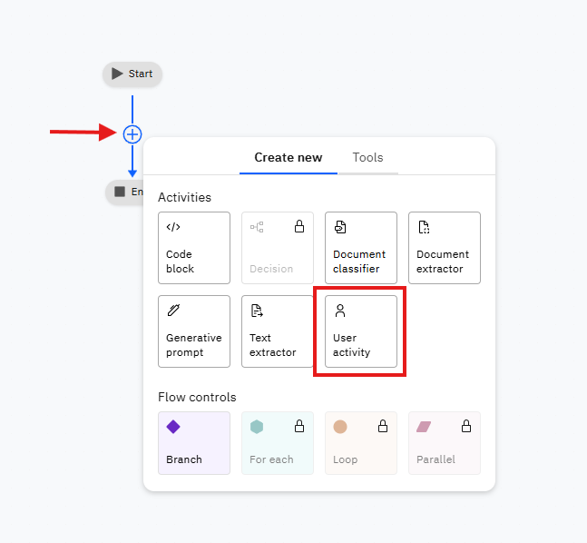
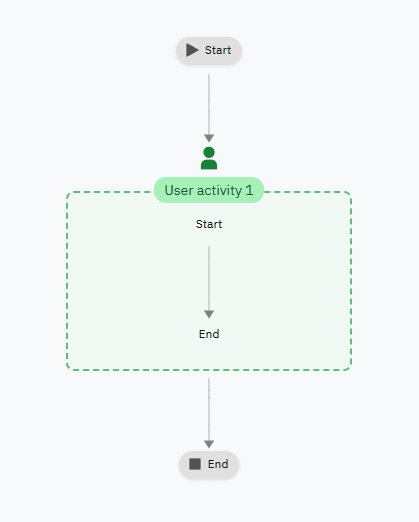

---

2. Ask the user to Upload Tax Invoice

- Edit the User Activity node's display name to: `กรุณาอัปโหลดใบกำกับภาษี`

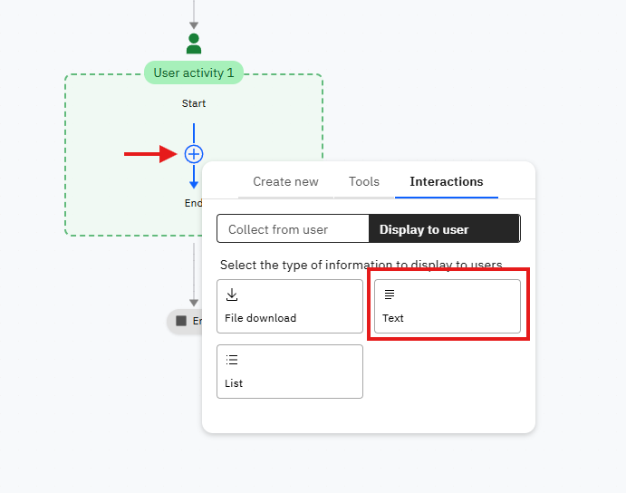


---

3. Add a File Upload inside the User Activity

- Drag a **File upload** into the User Activity node.
- Rename it to `Tax Invoice Uploader`.
- Configure it to accept PDF files.

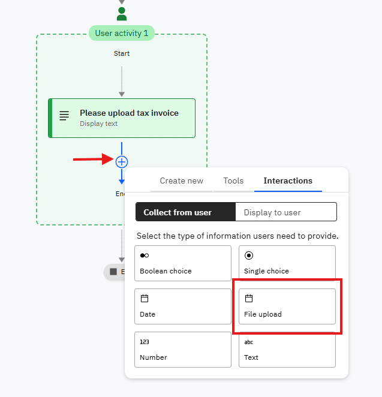

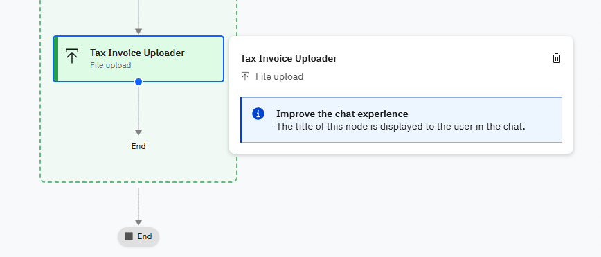

---

4. Add a Document Extractor inside the User Activity<br>
   4.1 Drag a `Document Extractor` into the User Activity node.<br>
   4.2 Rename it to `Invoice Field Extractor`.<br>
   4.3 Click Edit Fields<br>


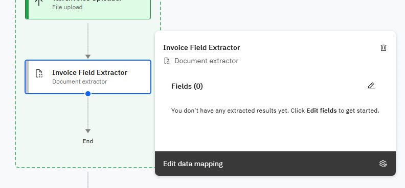


---

5. Configure Document Extractor Fields<br>
   The Document Extractor has 20 predefined fields available. For tax invoice validation, we need to configure the following key fields:


5.1 Configure `Invoice date` field

Put Description as `Extract the invoice date in any format (Thai year, Gregorian year, or short year format)`

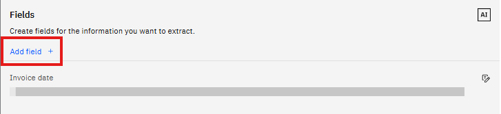

5.2 Configure `Company address` field

- For Company address Using Description as

```
Extract the complete company address including street, district, province, and postal code. Focus on identifying if the address is located in Thailand.
```

5.3 Configure `Company tax ID` field

- For Company tax ID Using Description as

```
Extract the company tax ID number. This should be a 13-digit number that represents the company's registration with the Department of Business Development (DBD) in Thailand.
```

5.4 Configure `Company name` field

- For Company name Using Description as

```
Extract the full company name as it appears on the invoice.
```

5.5 Configure `Invoice number` field

- For Invoice number Using Description as

```
Extract the invoice number or invoice reference number.
```

5.6 Configure `Customer name` field

- For Customer name Using Description as

```
Extract the customer name or buyer name from the invoice.
```

5.7 Configure `Customer address` field

- For Customer address Using Description as

```
Extract the customer address or buyer address from the invoice.
```

5.8 Configure `Total` field

- For Total Using Description as

```
Extract the total amount of the invoice including VAT.
```

5.9 Configure `VAT` field

- For VAT Using Description as

```
Extract the VAT amount or tax amount from the invoice.
```

5.10 Configure `Subtotal` field

- For Subtotal Using Description as

```
Extract the subtotal amount before VAT from the invoice.
```

**Note:** The Document Extractor provides 20 fields total. You can configure additional fields as needed for your specific validation requirements. The fields shown above are the essential ones for basic tax invoice validation.

#### Added All fields


---

6. Add a Generative Prompt for Rule Validation<br>
   6.1 Drag a **Generative prompt** into the User Activity node.<br>
   6.2 Rename it to `Invoice Validation Agent`.<br>
   6.3 Click Edit to configure the prompt settings.<br>


---

7. Configuration for the Generative Prompt<br>
   7.1 Input variables:

   - Name: `invoice_date`
   - Description: `The invoice date extracted from the document`
   - Click `Add` to save the input variable.

   - Name: `company_address`
   - Description: `The company address extracted from the document`
   - Click `Add` to save the input variable.

   - Name: `company_tax_id`
   - Description: `The company tax ID extracted from the document`
   - Click `Add` to save the input variable.

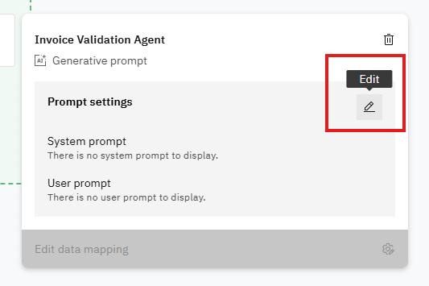

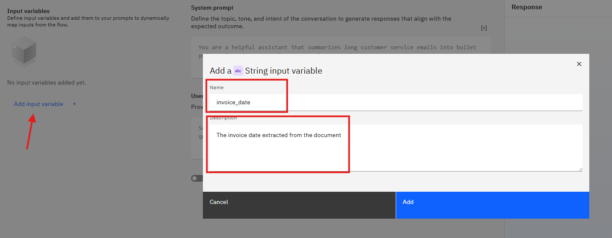

7.2 System prompt (use the exact rules below):

```
You are an invoice validation assistant.
Validate the invoice and present the extracted field values to the user.

Here are the extracted fields:
- Invoice Date: {invoice_date}
- Company Address: {company_address}
- Company Tax ID: {company_tax_id}

Validation rules:
1. Invoice date must be follow in:
   1.1 The current year
   1.2 Thai year (พ.ศ.) = Gregorian year + 543.
   1.3 Short year with 2 digits (like "60") usually refers to Thai year 2560, not 1960.
   1.4 The date is valid ONLY if it falls in the current year (Gregorian 2025 or Thai 2568).
2. Company address must be located in country Thailand.
3. Company Tax ID must be valid in Thai and valid in DBD system.
```

7.3 User prompt (what the flow will send to the model):

```
ONLY RESPONSE **Output as Object**
```

You should see similar to this when the prompt is configured:

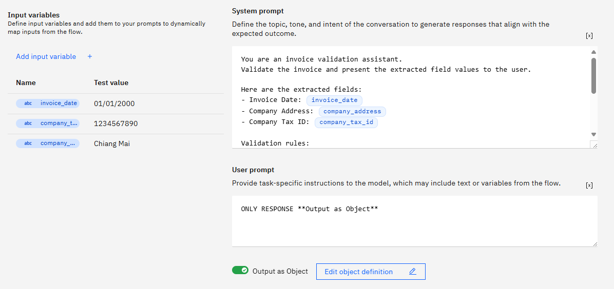

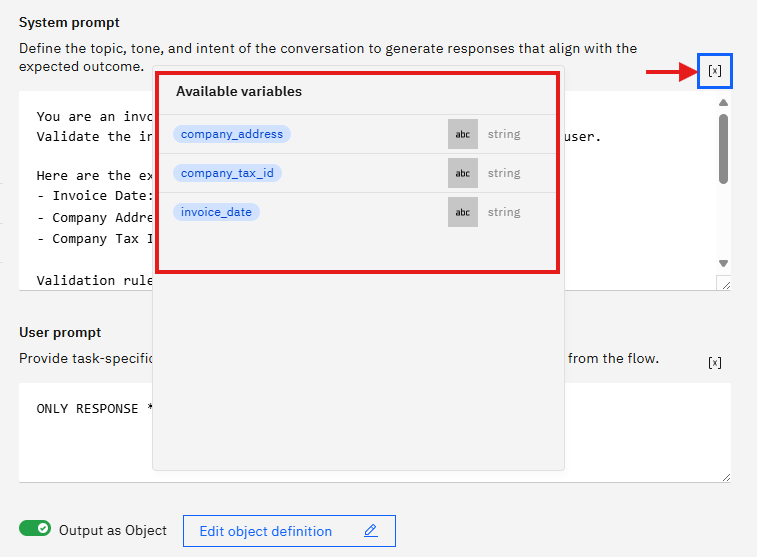

---

8. Custom Output for the Generative Prompt

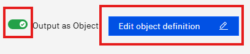

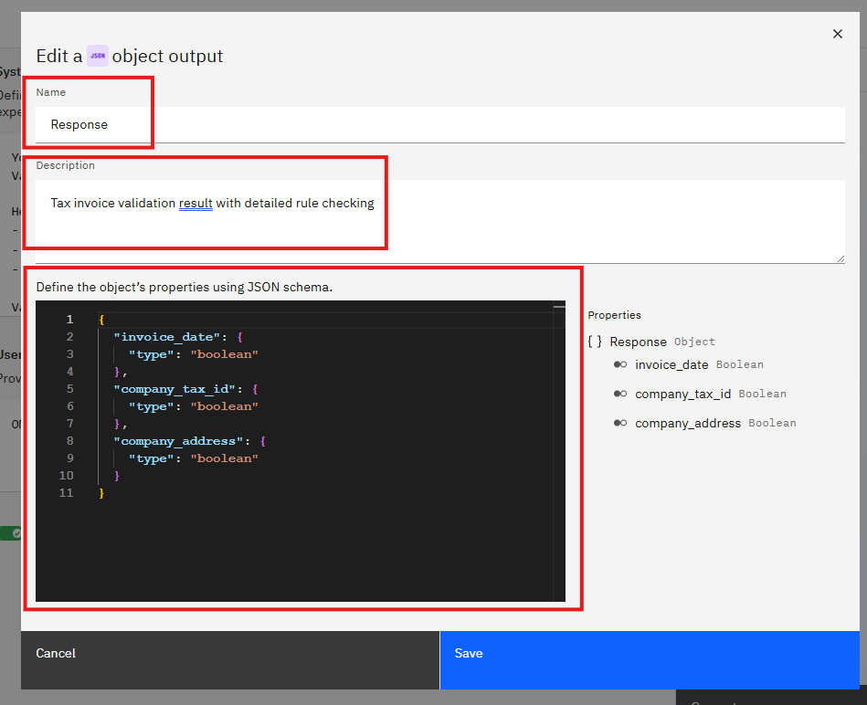

8.1 Change object output name to `Response` with description `Tax invoice validation result with detailed rule checking`

Use this JSON schema

```
{
  "invoice_date": {
    "type": "boolean"
  },
  "company_tax_id": {
    "type": "boolean"
  },
  "company_address": {
    "type": "boolean"
  }
}
```


Output would be similar like this.

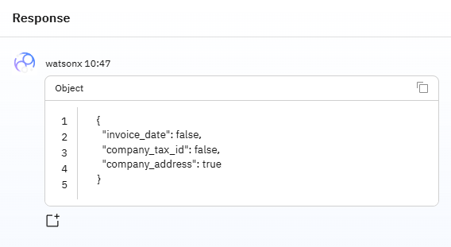

---

## Checkpoint: Current Workflow would be similar like this

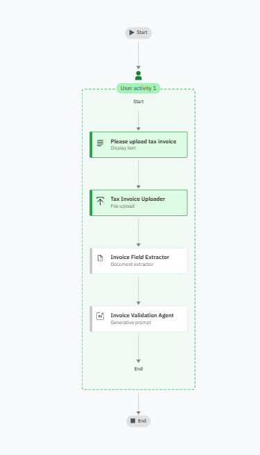

---

9. Add branch node for if-else condition

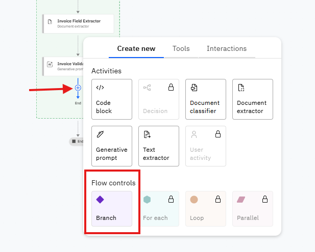

Edit the name to `Rule is valid or not`

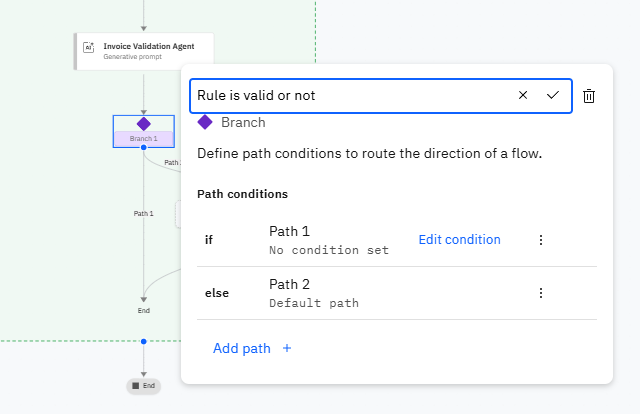

Edit the `if` condition to

- `Response.invoice_date == true`
- `Response.company_tax_id == true`
- `Response.company_address == true`

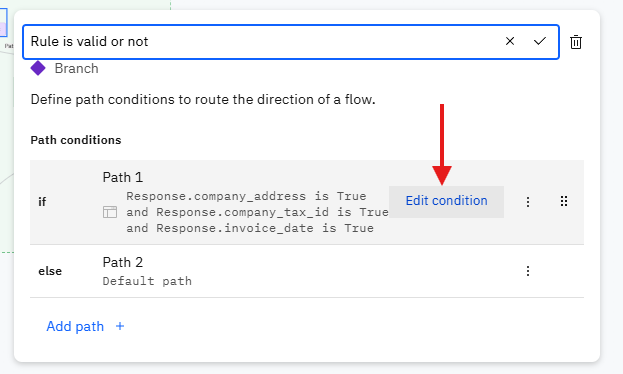

---

10. Add text for display to user

- Drag a **Text** into the branch node.
- Rename it to `Result`

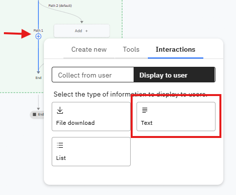

Edit the text to

```md
### คำขออนุมัติใบกำกับภาษีนี้ได้รับการอนุมัติเรียบร้อยแล้ว

ใบกำกับภาษีดังกล่าวผ่านการตรวจสอบตามเงื่อนไขที่กำหนดครบถ้วน และสามารถดำเนินการต่อไปตามระบบงานได้
```


For the `else` condition, add text to display to user

```md
### คำขออนุมัติใบกำกับภาษีนี้ไม่ได้รับการอนุมัติ

ใบกำกับภาษีดังกล่าวไม่ผ่านการตรวจสอบตามเงื่อนไขที่กำหนด กรุณาตรวจสอบและแก้ไขข้อมูลก่อนยื่นใหม่
```


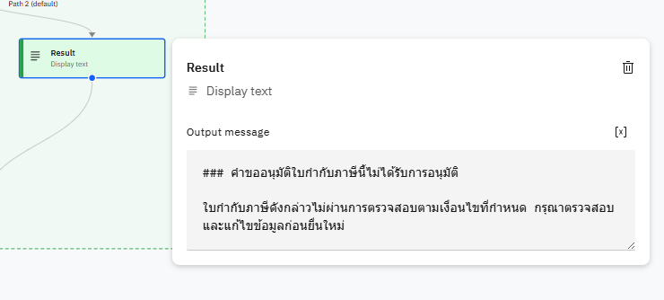

---

### Testing

Test the agent with these sample inputs:

- `ฉันต้องการตรวจสอบใบกำกับภาษี`

ps. You can click the image to watch the video.

[](videos/test_input_example.mp4)

- The Agent will allow you to upload a tax invoice PDF file
- The Agent will extract the required fields and validate against the rules
- The Agent will provide a detailed validation result in Thai

## Example Output

For a valid invoice:

```md
### คำขออนุมัติใบกำกับภาษีนี้ได้รับการอนุมัติเรียบร้อยแล้ว

ใบกำกับภาษีดังกล่าวผ่านการตรวจสอบตามเงื่อนไขที่กำหนดครบถ้วน และสามารถดำเนินการต่อไปตามระบบงานได้
```

## Validation Rules Summary

1. **Date Validation**: Invoice date must be in the current year (2025 Gregorian or 2568 Thai)
2. **Address Validation**: Company address must be located in Thailand
3. **Tax ID Validation**: Company Tax ID must be a valid 13-digit Thai tax ID

The agent will provide detailed explanations for each validation rule and an overall result indicating whether the tax invoice is valid or invalid.
