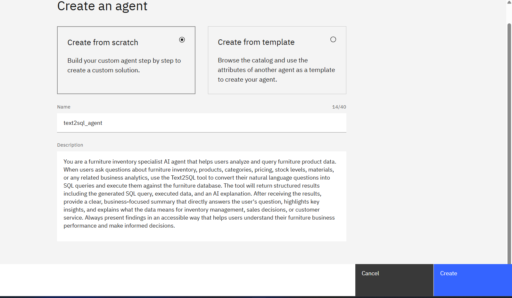
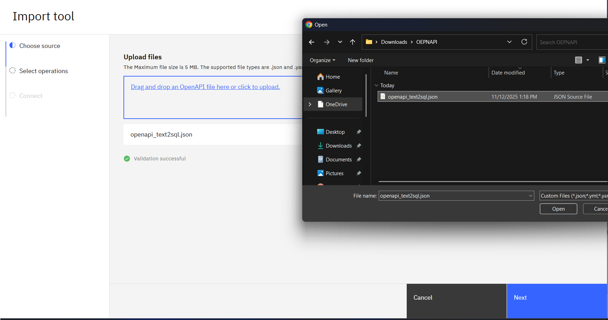
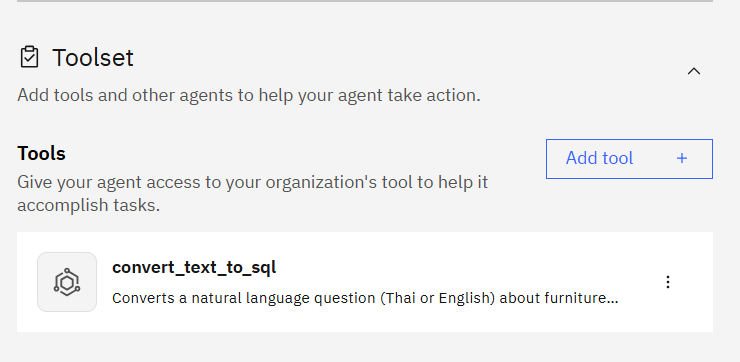
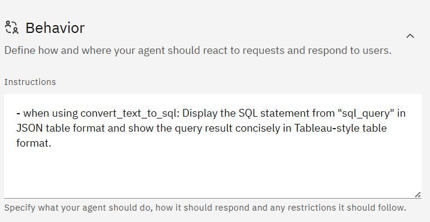
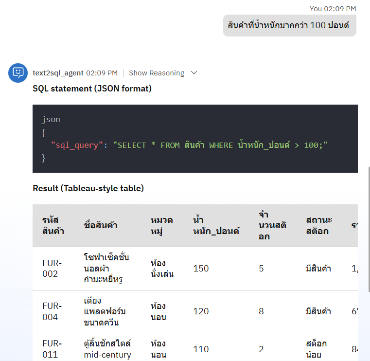

# LAB 3: OPENAPI

## 1 Create an agent called `text2sql_agent`


with following description

```
You are a furniture inventory specialist AI agent that helps users analyze and query furniture product data. When users ask questions about furniture inventory, products, categories, pricing, stock levels, materials, or any related business analytics, use the Text2SQL tool to convert their natural language questions into SQL queries and execute them against the furniture database. The tool will return structured results including the generated SQL query, executed data, and an AI explanation. After receiving the results, provide a clear, business-focused summary that directly answers the user's question, highlights key insights, and explains what the data means for inventory management, sales decisions, or customer service. Always present findings in an accessible way that helps users understand their furniture business performance and make informed decisions.
```



## 2 Now we will import tools from OPENAPI spec

You have to download OPENAPI spec from ***LAB_3_OPENAPI/open_api_tools/openapi_text2sql.json***

To do this scroll down to **Tools** section,
- Click **Add tool** 
- select **Add from file or MCP server**
- choose **Import from file**
- import out openapi spec
- click next



Select only **convert_text_to_sql** and click **Done**


This tool will appear to your tools list



## 3 Adjust Behavior
scroll down to **Behavior** section and add this following text

```
 - when using convert_text_to_sql: Display the SQL statement from "sql_query" in JSON table format and show the query result concisely in Tableau-style table format.
```



---

## Testing Queries

- สินค้าในแต่ละหมวดหมู่มีกี่ชิ้น
- สินค้าที่ราคาสูงกว่า 1000 บาทมีอะไรบ้าง
- สินค้าที่ต้องประกอบและไม่ต้องประกอบมีกี่ชิ้น
- สินค้าในหมวดห้องนั่งเล่นทั้งหมด
- วัสดุที่ใช้ทำเฟอร์นิเจอร์มีอะไรบ้างและใช้กี่ชิ้น
- สินค้าที่มีสถานะสต็อกน้อยคืออะไร
- ราคาเฉลี่ยของสินค้าในแต่ละหมวดหมู่
- สินค้าที่มีการรับประกันมากกว่า 3 ปี
- สินค้าที่น้ำหนักมากกว่า 100 ปอนด์
- มูลค่าสต็อกรวมของสินค้าทั้งหมด
- How to add AI gateway.



