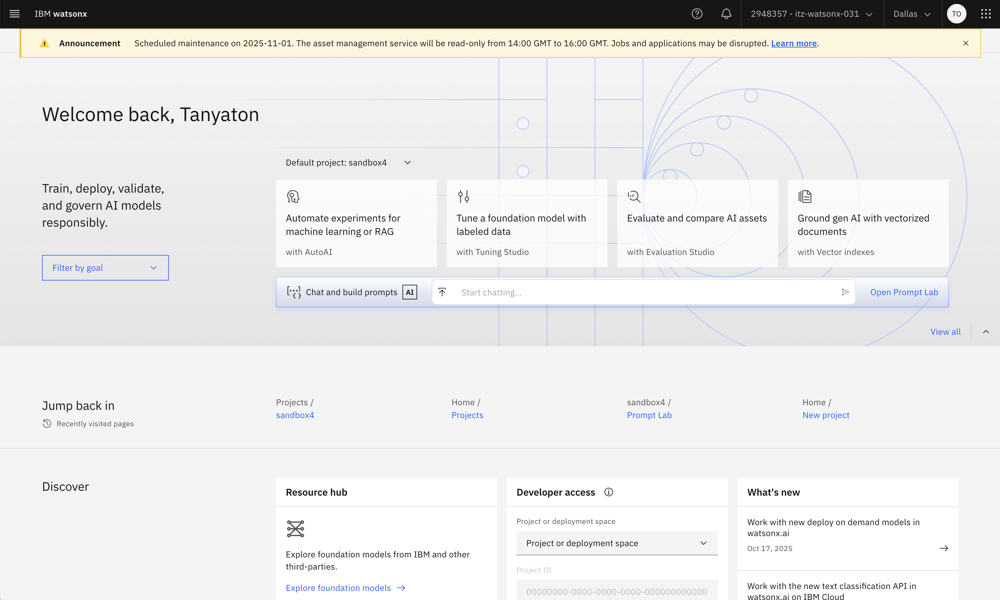
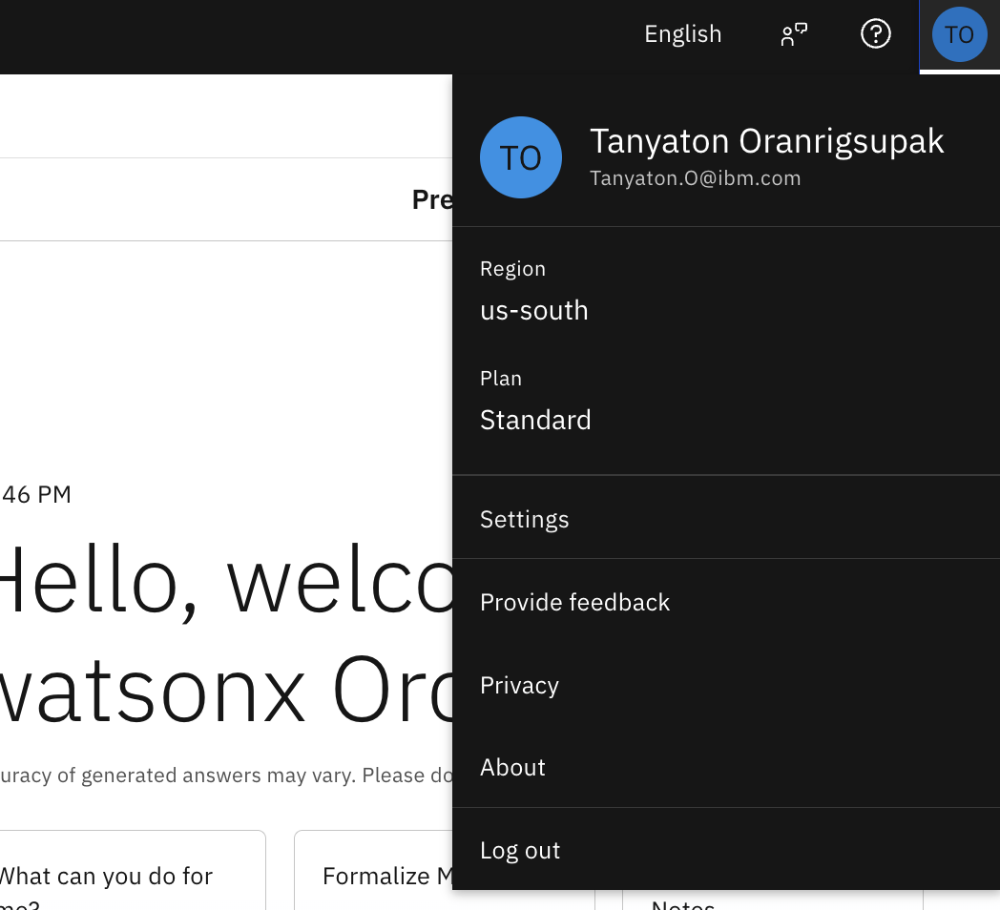
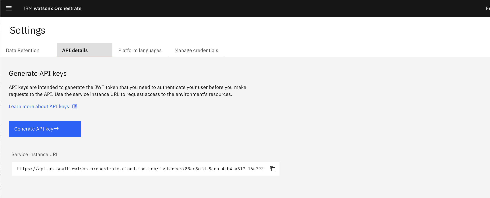
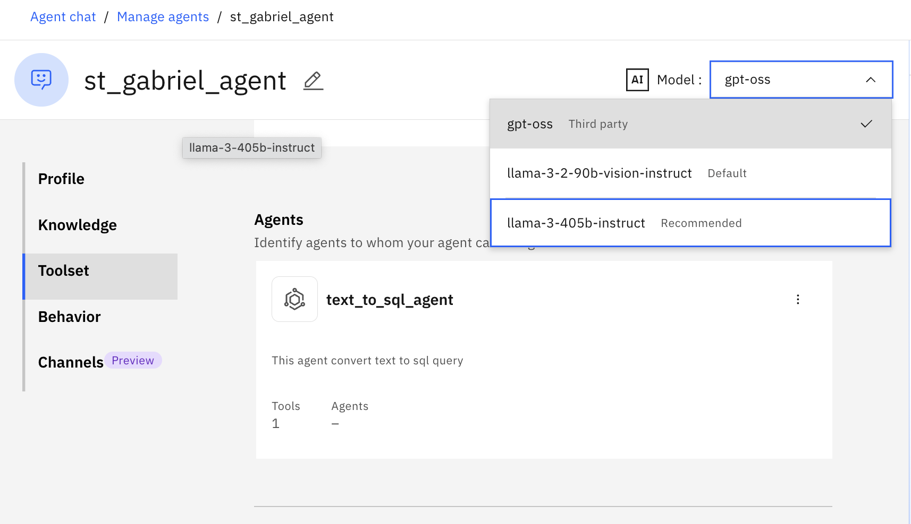

## Add external model from watsonx.ai

# watsonx.ai setup
1. go to watsonx.ai page, login with IBMid. Home page will look like this 
2. scroll down to project and create new project
3. add name to project and click create 
4. go i n the project you create > go to `Manage` tab > then `Service & Integration` > Click `Assosiate Serice`
5. Associate service


6. Click on `General` sidebar, copy the `Project ID` and save it


7. create `.env` file in the `watsonx` folder. Paste the content below

```
WATSONX_API_KEY=
WATSONX_PROJECT_ID=
```
8. Add the project ID to `WATSONX_PROJECT_ID` and add the `WATSONX_API_KEY` you get from your IBM cloud (if you have not obtain `WATSONX_API_KEY`, follow this instruction on the main page here)

# Obtain your watsonx.Orchestrate instance url and api key: 
9. obtain `WO_URL` by go to you wxo page > click on your profile on the right corner and go to `Setting`

11. go to  and copy your `WO_URL`. Here you can generate new API key or use that same one you have generated earlier.

# Adding model to watsonx.Orchestrate instance
10. run the following command in folder `watsonx`. The command below is run to setup orchestrate environment. After run the second command, you will be prompt to input your `WATSONX_API_KEY` you obtain earlier.
```
orchestrate env add -n stgb-inox -u <your-WO_URL>
orchestrate env activate stgb-inox
```
After that, run command below to setup model connection

```
orchestrate env add -n stgb-inox -u <your-WO_URL>
```
bash setup_connection.sh
```
Then, run the following command to add model
```
bash add_model.sh
```
10. the model should now show uo on your instance


