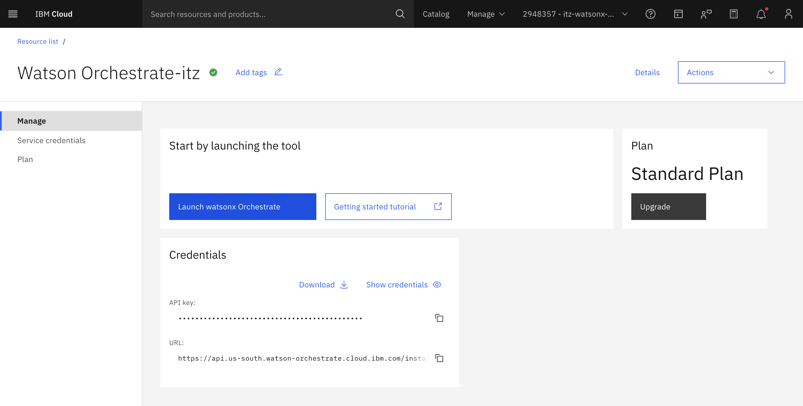
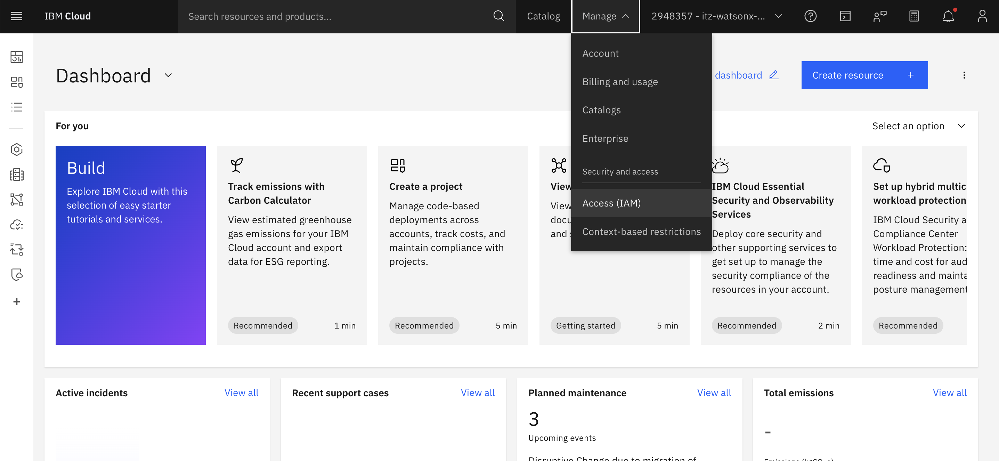

# This repo componet
This repo is for implementing text-to-SQL solution using Watsonx Orchestrate
- To **create agent with WXO UI or ADK**: follow instruction on [this folder](https://github.com/tanyaaton/stgabriel-text2sql-main/tree/main/ORCHETRATE)
- To **add external AI model** from watsonx.ai: follow instruction on [this folder](https://github.com/tanyaaton/stgabriel-text2sql-main/tree/main/ORCHETRATE/AI_gateway)
- To **deploy API service** that input query and reply with json response: see [this folder](https://github.com/tanyaaton/stgabriel-text2sql-main/tree/main/BE_db_only)
- To **deploy API service** with built-in LLM to create query and expian result: see [this folder](https://github.com/tanyaaton/stgabriel-text2sql-main/tree/main/BE)
- To **embed agent in webpage + context variables**: see [this folder](https://github.com/tanyaaton/stgabriel-text2sql-main/tree/main/context_variables)

## Access watsonx.Orcheatrate and watsonx.ai instance
1. You will recieve email from IBM Cloud for your Techzone environment invitation. click `Join now`, and it will redirect your to [IBM Cloud](https://cloud.ibm.com/) page.

2. Create IBM account and join the environment
3. Go to [ibm cloud page](https://cloud.ibm.com/)
4. click on side bar menu and go to `Resource list`

5. Under the `AI / Machine learning` session, you will see **watsonx.Orchestrate** and **watsonx.ai** instance. Click on the instance and click `Launch watsonx Orchestrate` for **watsonx.Orchestrate**, and `Launch in watsonx` for **watsonx.ai**

## Obtian IBM Watsonx API key
1. login to [ibm cloud page](https://cloud.ibm.com/) with your IBM ID 
2. login to ibmcloud page > `Manage` > `Access(IAM)`

3. Go to `API keys` on the side bar > `Create` 

4. Save this for later, this will be used when you need to use [watsonx Orchestrate ADK](https://developer.watson-orchestrate.ibm.com/) (eg, to add external model, import agent)