### Instructions

This lab shows how to create an agent and a simple flow that accepts a job position from the user and compares candidates' resumes  The output will be a score for candidate, indicating how well their resume matches the job position.

Prerequisites
- Access to the Studio UI where agents and flows are created.

## Steps
1. Create the agent<br/>
    1.1 Choose `create from scratch`<br>
    1.2 Create a new agent named `resume_scoring_agent` <br>
    1.3 Set the description to :<br>
    `This agent using when need to compare candidate's resume align with job position the output will be scoring of candidate resume` 
---

2. Add a Tool that Using a New Flow <br>
    2.1 In the agent settings, open the Toolset section and click **Add tool**.<br>
    2.2 Choose **Create a new flow**.<br>
    
    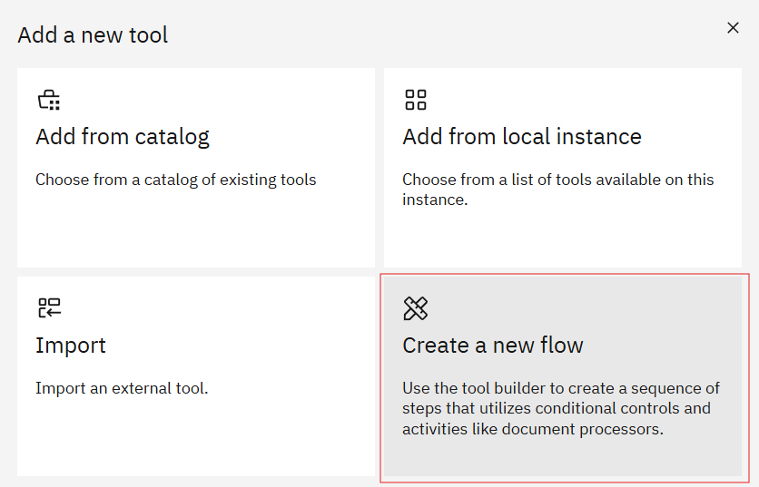

    2.3 Click the flow title (usually `Untitled`) in the top-left to open the flow settings.
    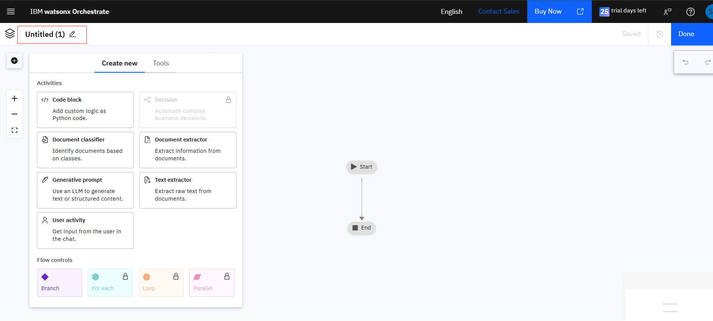

    2.4 Change the tool name to `resume_scoring_tool` and set the description to `This tool using when user need to compare candidate's resume. when using this tool Don't ask any question follow the flow only`.<br>
    2.5 Click Save.

    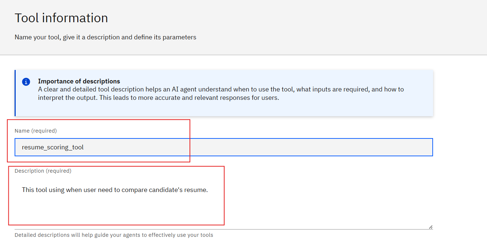
---

#### Create the workflow
1) Add a User Activity node
- Hover over the connection line between Start and End until a plus (+) appears.
- Click the plus icon and select `User activity` from the menu.


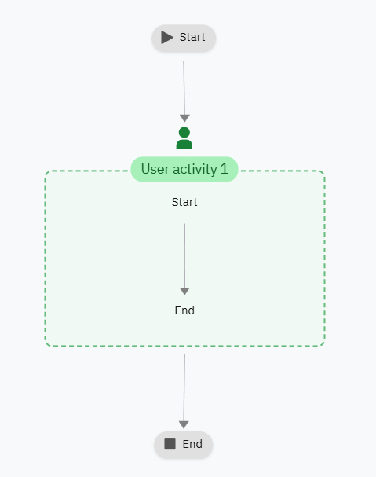

---

2) Ask the user for the Job Position
- Edit the User Activity node's display name to: `กรุณากรอกรายละเอียดของตำแหน่งงาน`


---

3) Add a Generative Prompt inside the User Activity
- Drag a **Generative prompt** into the User Activity node.
- Rename it to `Generative Job Position`.
- Click Edit to accept input from the previous step.


- rename it to **Generative prompt expected_criteria**


---

4) Configuration for the Generative Prompt<br>
  4.1 Input variable:
    - Name: `job_position`
    - Description: `Job position which user interested`
    - Click `Add` to save the input variable.


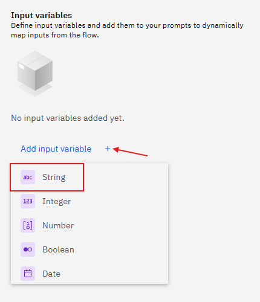


4.2 System prompt (use the exact rules below):

```
Rules:
1. Answer in JSON format only. 
2. You will get job position from user query and you will return only related information for that job position. 
3. Do NOT ask any question from user. They will give you a job position and you will return JSON only.
4. Ensure all fields are filled with appropriate data and avoid leaving any blank (e.g., 'not specified').
5. For the experience field, provide in-depth details and a comprehensive description. Do not just include a number or a short phrase. Describe the nature of the experience required for the job position (e.g., responsibilities, seniority level, or related skills)
```

4.3 User prompt (what the flow will send to the model):
```
job position:
```

You should see similar to this when the prompt is configured:

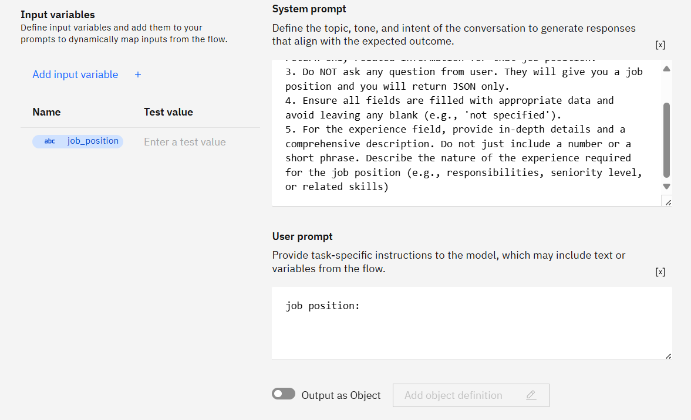


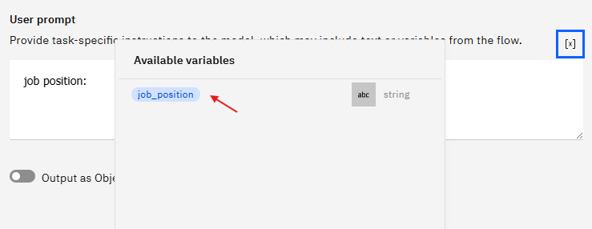

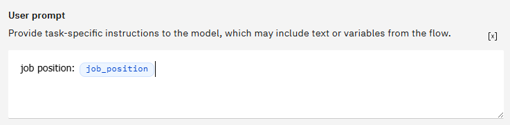

---

5) Custom Output for the Generative Prompt


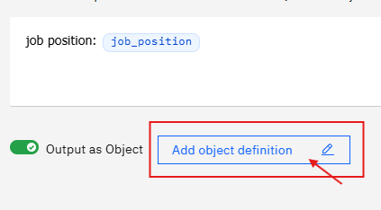

5.1 Change object output name to ```expected_criteria ``` with description ```expected_criteria align with job```

Use this JSON schema
```
{
  "skills": {
    "type": "string"
  },
  "experience": {
    "type": "string"
  }
}
```


- Change the model to ``` llama-4-maverick-17b-128e-instruct-fp8 ```, Test Generative output :


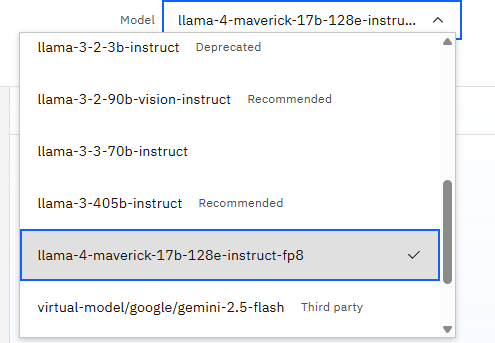

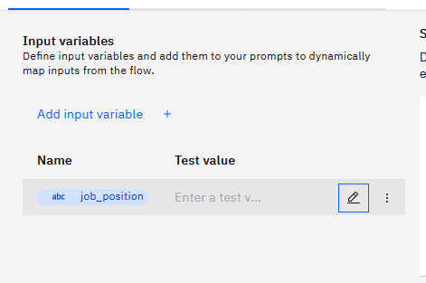


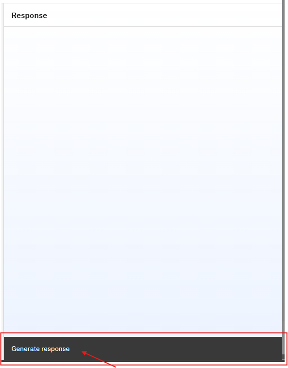

Output would be simliar like this.


---

6) Now Add new flow to upload Candidate's Resume 


6.1 change name to  **Resume uploader1**


---

7) Add a 1st Document Extractor  inside the User Activity<br>
  7.1 Drag a `Document Extractor` into the User Activity node.<br>
  7.2 Rename it to `Resume extractor`.<br>
  7.3 Click Edit Fields<br>


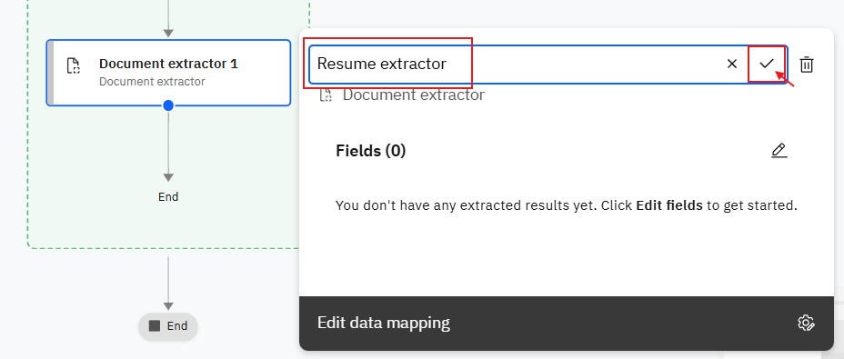


---
8) Download and Upload Sample Resumes<br>
  8.1 Download resumes from:
    -  `sample/jr-sale-resume.pdf` 
    -  `sample/sr-sale-resume.pdf`<br>

8.2 Upload `jr-sales-resume.pdf`

8.3 Click **Add Field**, name it as `name` and configure the Field

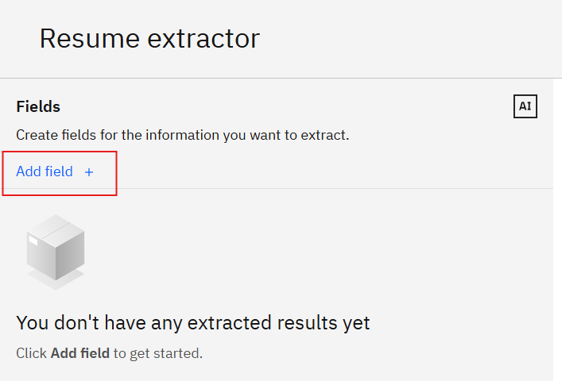

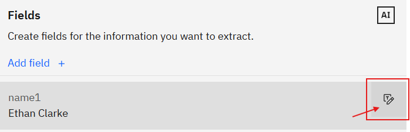

Put Description as 
```
Extract the full name of the candidate. The name is usually located at the very top of the document and 
is often displayed in a larger font. It should be a person's name, not a generic title like 'Resume' or 'Curriculum Vitae'. 
Exclude any nearby contact information such as phone numbers, email addresses, or website links.
```


And Click **Back Arrow** top left corner.

8.4 Click **Add Field**, names it as `skills` and configure the Field

- For skills Using Description as
```
Identify the skills section, which may be under headings like 'Skills', 'Key Skills', 'Technical Skills', 'Proficiencies', or 'Core Competencies'. Extract all individual skills mentioned into a list. The skills can be separated by commas, bullet points, or new lines. If skills are categorized (e.g., 'Programming Languages', 'Databases'), extract all of them into a single, flat list.
```

8.5 Click **Add Field** names it as `experiences` and configure the Field

- For experiences Using Description as
```
Extract the entire work history section. This section may be titled 'Experience', 'Work Experience', 'Professional Experience', 'Employment History', 'Career History', or 'Relevant Experience'. Include all job entries listed, capturing the company name, job title, dates of employment, and the description of responsibilities for each role.
```

8.6 Open document dropdown and Click **Mangage documents** and upload file from ```sameple/sr-sale-resume.pdf```
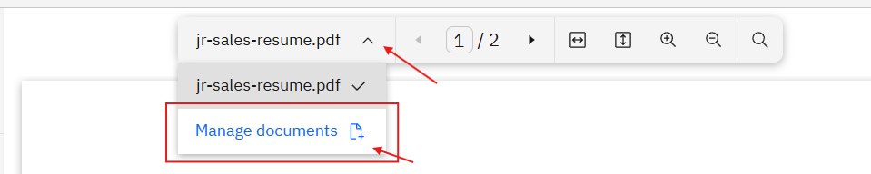
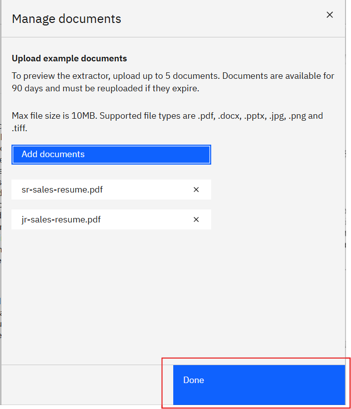

---

## Checkpoint: Current Workflow would be similar like this
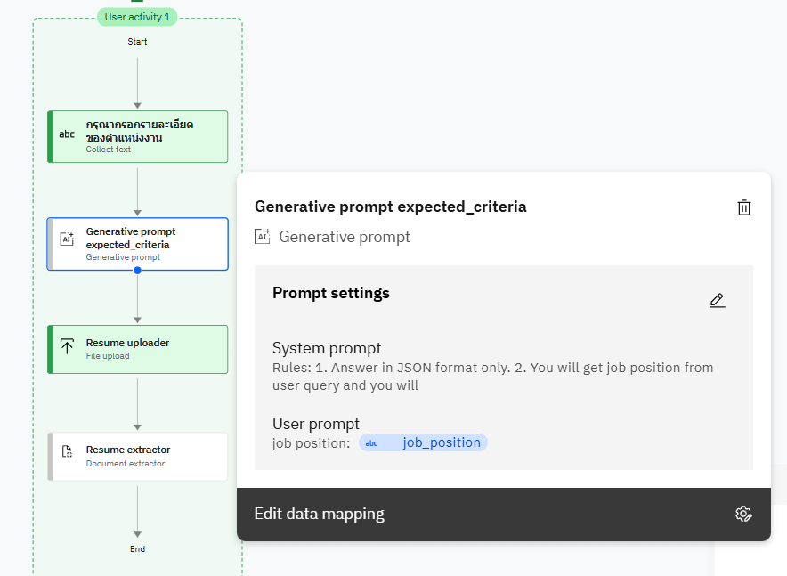
<br>
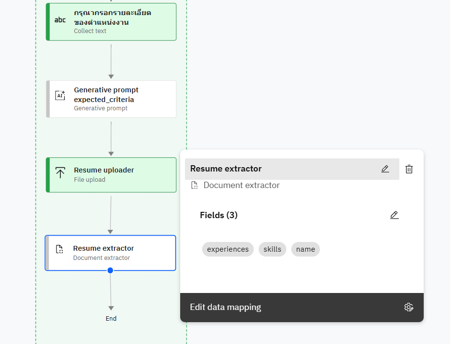
<br>

---

9. Drag Generative prompt into user flow name it as `scoring agent` Click Edit prompt settings<br>

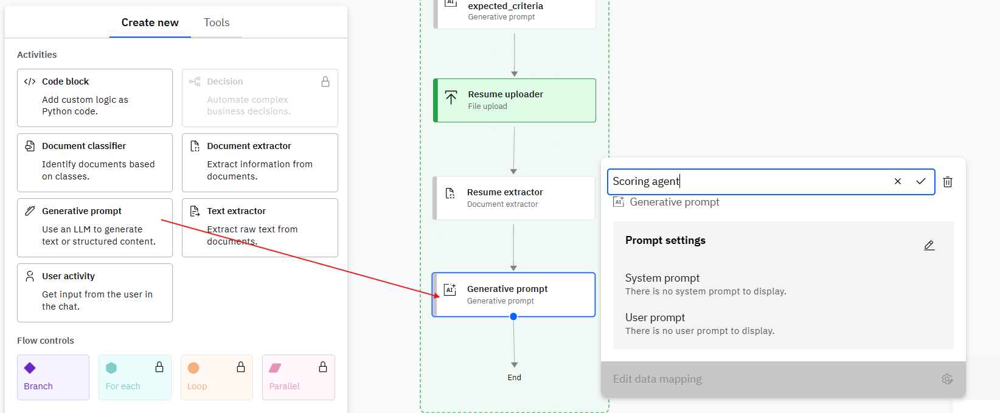

9.1  Click **Add input variable** and select variable type as **String**


9.2 Name the input variable. Repeat this process for all required variables:

- `name`  
  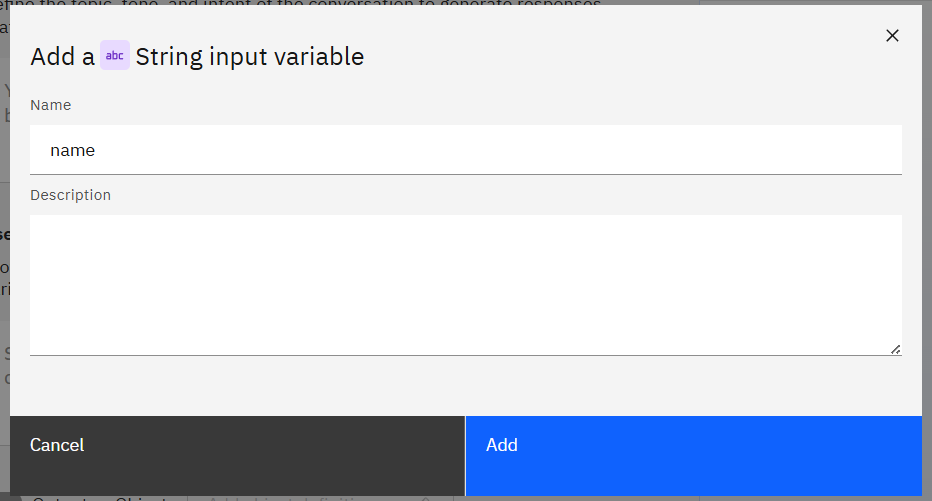
- `skills`
- `experiences`
- `expected_criteria_experiences`
- `expected_criteria_skills`

9.3 For each variable:  
- Click **Add input variable**  
- Choose **String** as the type  
- Enter the variable name  
- Click **Save/Add**  

9.4 After adding all variables, your Generative Prompt input variables should include:

  

9.5 Add this into System prompt exactly
```
You are a resume comparison agent. Compare candidates' resume against the provided expected criteria. For each candidate, score them on a scale of 0-100, where 100 means the resume fully matches the criteria and 0 means no match. The comparison should be based on the following:
1. **Skills**: Evaluate the alignment of the candidate's skills with the job's requirements.
2. **Experiences**: Assess the relevance and quality of the candidate's experiences, including years of experiences and the level of responsibility.
3. **Achievements**: Review the candidate's notable achievements that demonstrate their ability to succeed in the role.
4. **Other Key Factors**: Consider any other relevant factors such as certifications, leadership, and adaptability.

For each candidate, provide a detailed breakdown of the score in these sections:
- **Skills**: Explain how well the candidate’s skills align with the job’s requirements.
- **Experiences**: Detail the relevance of their experiences to the role, including the number of years and level of seniority.
- **Achievements**: Highlight significant accomplishments and their impact.
- **Other Key Factors**: Mention additional qualities or experiences that may impact their suitability for the job.

The output should include a **score** for each candidate along with **explanations** for each of the above categories, ensuring that candidate are evaluated equally and fairly.

**OUTPUT MUST BE IN THAI AND IN MARKDOWN FORMAT**
```
 
9.6 Add user prompt as
```
Candidate: candidate name={name}, skills={skills}, experiences={experiences}
expected_criteria: {expected_criteria_experiences}, {expected_criteria_skills}
```

The output should be as

  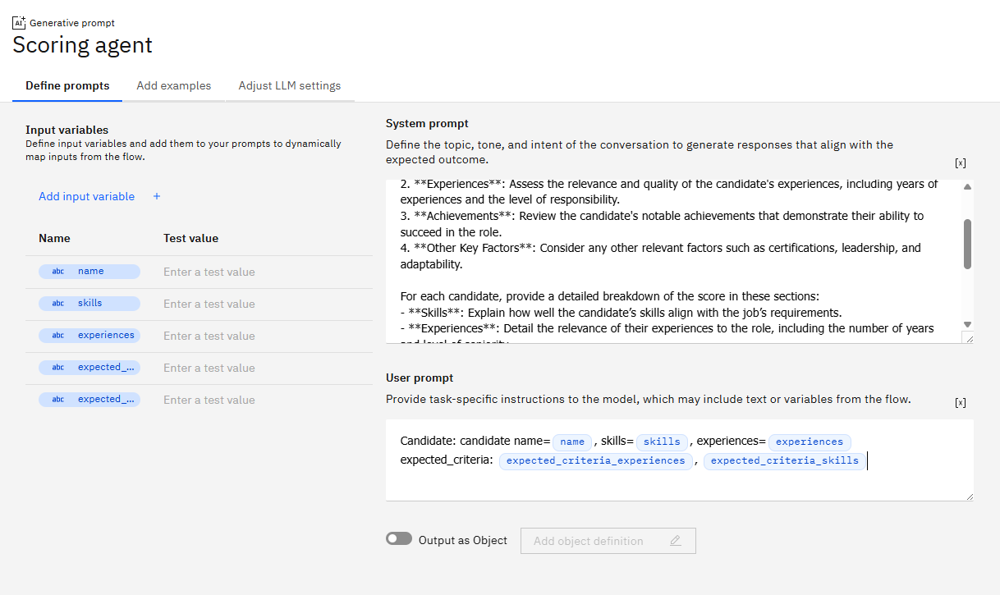

9.7 Change the Model to **llama-4-maverick-17b-128e-instruct-fp8**

  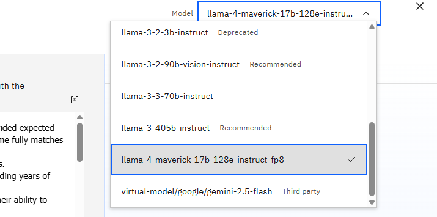

  This is lastest workflow then click **done** on top right corner

  

  ---
13 Change the main Model to **llama-3-405b-instruct / gemini-2.5-flash**

  

14 Scroll down to **Beheavior Section** and add this instructions:
```
- You have to use tool named "resume_scoring_tool" whenever user ask about comparing candidate scoring or user want to upload resume for comparing. 
- You must answer in Thai.
```
  

  ---

  ### Testing
  
  - `ฉันอยากเปรียบเทียบ resume ของ candidate` / `เช็คคะแนน resume`
  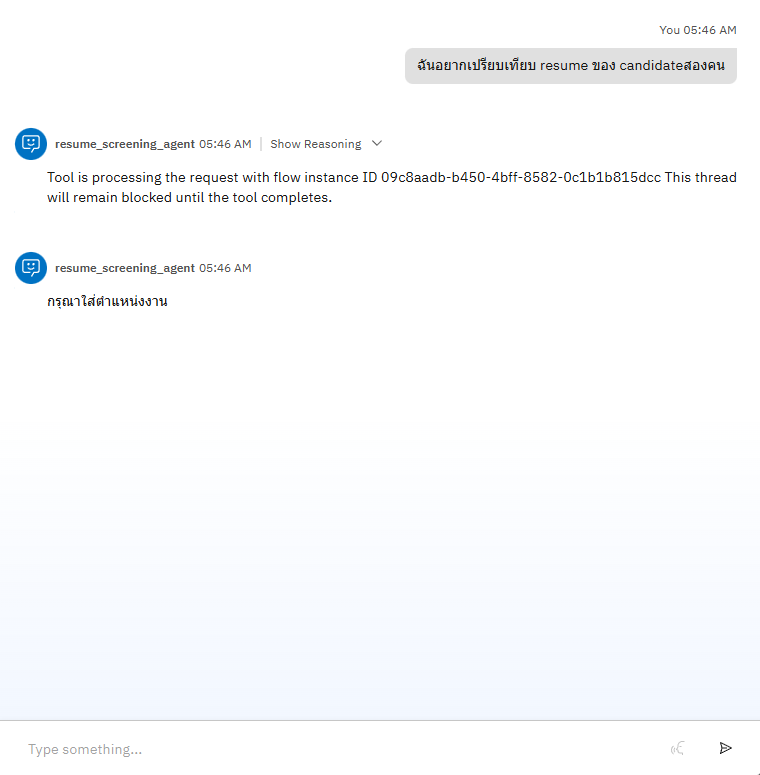

- Answer with
```
A Senior Sales professional with a strong background in both B2B and B2C sales, equipped with
excellent communication skills essential for building client relationships and closing high-level deals.
Experience spans from managing existing clients to acquiring new ones across diverse markets.
```
```
ผู้เชี่ยวชาญด้านการขายระดับอาวุโส ที่มีประสบการณ์อย่างลึกซึ้งทั้งในงานขายแบบ B2B และ B2C พร้อมทักษะการสื่อสารที่ยอดเยี่ยม ซึ่งมีความสำคัญต่อการสร้างความสัมพันธ์กับลูกค้าและปิดการขายในระดับสูง
มีประสบการณ์ทั้งด้านการดูแลลูกค้าเดิมและการขยายฐานลูกค้าใหม่ในหลากหลายตลาด
```

- The Agent will allow you to upload candidate resume  Upload pdf from```test/test-sr-sales.pdf```

## Example

  

  

  


