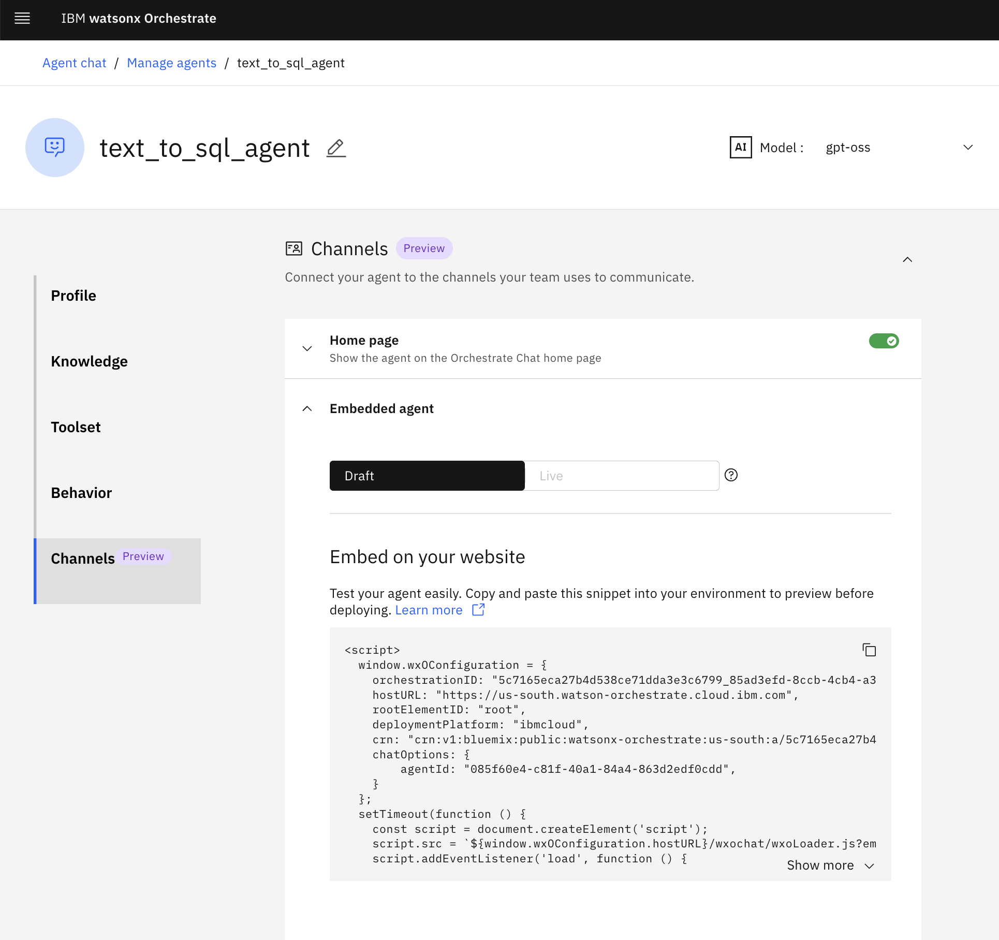

<h2>Secure embed example</h2>

<b>Steps to embed the wxO chat experience(with security).</b><br>

1. Download this folder to your system.
2. run `wxo.sh`
    - Input URL + api key
    - Select an action (select 2nd obtion):
        1) *Configure security with custom keys (Recommended)*: create new key for security -> generate wxo_security_config folder with many keys
        2) *Disable security and allow anonymous access (Only for specific use cases)* : Deactivate security (cannot pass context variable): 
        3) View current configuration only
        4) Exit
3. Update the public key in chat config screen with the [sample public key](./keys/example-jwtRS256.key.pub).
4. Change path for key in file `createJWT.js`

5. Fix format of ibm_public_key.pem -> Replace **/n** with enter

6. fix the agent configuration to your agent in the `index.html` file. Get this from the watsonx.Orchestrate agent page in section `embedded to UI`. Either life or draft agent is fine


```
window.wxOConfiguration = {
      orchestrationID: "20251008-xxxx-xxxx-xxxx-xxxxxxxxxxx_xxxxxxxx-",
      hostURL: "https://eu-central-1.dl.watson-orchestrate.ibm.com",
      rootElementID: "root",
      chatOptions: {
        agentId: "xxxxxxxx-xxxx-xxxx-xxxx-xxxxxxxxxxx",
        agentEnvironmentId: "xxxxxxxx-xxxx-xxxx-xxxx-xxxxxxxxxxx",
      }
    };
```

6. Run the following command to install requirement 
```
npm ci
```
and the following command to start app
```
npm start
```

Front page:
http://localhost:5555/index.html


------
7. (Optional) Of you want to add other context variable you want to pass on, adjust `createJWT.js` file in the `createJWT` function

for example:
```
function createJWT(request, response) {
  const anonymousUserID = getOrSetAnonymousID(request, response);
  const sessionInfo = getSessionInfo(request);
  const context = {
    employee_id: request.query.emp_id || "emp001",
    employee_name: request.query.emp_name || "John Smith",
    employee_role: request.query.emp_role || "Employee",
    is_active: true,
  };
  const token = createJWTString(anonymousUserID, sessionInfo, context);
  response.send(token);
}
```
also add the function to the `index.html` file to get other variables

for eample:
```
useEffect(() => {
    function getEmpId() {
      const empId = localStorage.getItem('user')
        ? JSON.parse(localStorage.getItem('user') || '{}').id
        : 'emp001'
      return empId
    }

    function getEmpName() {
      const empName = localStorage.getItem('user')
        ? JSON.parse(localStorage.getItem('user') || '{}').name
        : 'John Doe'
      return empName
    }
    function getRole() {
      const role = localStorage.getItem('user')
        ? JSON.parse(localStorage.getItem('user') || '{}').role
        : 'employee'
      return role
    }

    async function getIdentityToken() {
      // In a real environment, this will make a call to your server to request a new JWT.

      const result = await fetch(
        `${env.NEXT_PUBLIC_API_URL}/createJWT?emp_id=${getEmpId()}&emp_name=${getEmpName()}&emp_role=${getRole()}`
      )

      return await result.text()
    }

```


- Copy the embed script from chat settings into [index.html](./static/index.html) file. <br>


Note:
- Keys pasted in the [assistant-toolkit](https://github.com/watson-developer-cloud/assistant-toolkit/tree/master/integrations/webchat/examples/web-chat-security-simple/server/nodejs-express/keys) are not actual secrets.<br>
- These are used only in the examples provided in this repository.


## example of agent prompt to recieve context variables

the followin gis the example of behavior of agent that recieve 2 context variable (`employee_id` and `employee_role`) and how to add context variable to agent is provide in the folder agent_yml_example

add to yml file
```
context_variables:
  - employee_id
  - employee_name
```
